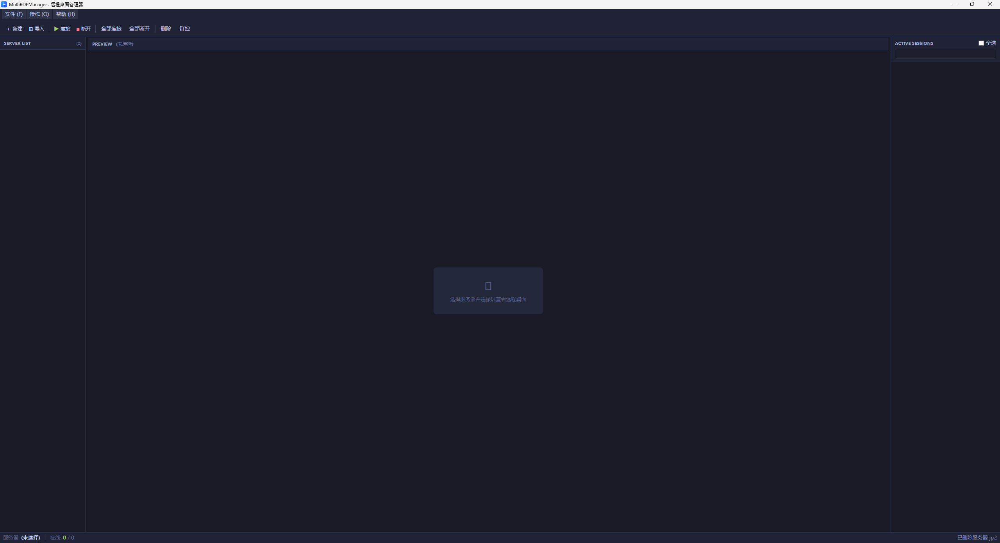

<div align="center">
  <h1>MultiRDPManager</h1>
  <p><strong>多会话远程桌面连接管理器 · Multi-session RDP Connection Manager</strong></p>

  <p>
    
    
    
    
  </p>

  <p>基于 FreeRDP 的多窗口远程桌面管理器，支持批量连接、群组控制与实时缩略图监控</p>
  <p>Multi-window RDP remote desktop manager — batch connection, group control, and real-time thumbnail monitoring</p>

  <br>
  
  <a href="https://github.com/duchenyu/MultiRDPManager/releases">
    
  </a>
</div>

---

## ✨ 功能特性 / Features

<table>
<tr>
<td width="50%">

### 🖥️ 多会话管理
- 左侧面板管理多个服务器连接
- 中央区域预览远程桌面
- 支持同时打开多个 RDP 会话
- 中英文双语界面

</td>
<td width="50%">

### 📥 批量导入
- 通过 CSV 文件批量导入服务器
- 支持名称、IP、用户名、密码字段
- 一键导入，快速部署
- 支持保存服务器列表

</td>
</tr>
<tr>
<td width="50%">

### 🎮 群组控制模式
- 主控会话同步鼠标/键盘输入到所有从属会话
- 支持主控切换
- 批量操作，统一管理
- 适合多服务器协同运维

</td>
<td width="50%">

### 👁️ 缩略图面板
- 所有连接的会话实时缩略图预览
- 支持搜索过滤
- 快速定位目标会话
- 直观监控所有远程桌面状态

</td>
</tr>
<tr>
<td width="50%">

### 🌙 深色主题
- 专为服务器管理设计的深色界面
- 护眼配色方案
- 现代简约 UI 风格
- 长期使用更舒适

</td>
<td width="50%">

### 🌐 多语言支持
- 简体中文界面
- English interface
- 运行时自动检测系统语言
- 可在设置中手动切换

</td>
</tr>
</table>

## 🔧 技术栈 / Tech Stack

| 技术 | 用途 |
|------|------|
| **WPF** (.NET 8, win-x64) | 桌面应用程序框架 |
| **FreeRDP** | RDP 远程桌面协议实现 |
| **RoyalApps.Community.FreeRdp.WinForms** v2.0 | FreeRDP .NET 封装 |
| **Windows Global Hooks** | 群组控制输入转发（WH_MOUSE_LL / WH_KEYBOARD_LL） |

## 🚀 快速开始 / Quick Start

### 下载即用 / Download & Run

从 [Releases](https://github.com/duchenyu/MultiRDPManager/releases) 页面下载 `MultiRDPManager.FreeRDP.exe`（中文版）或 `MultiRDPManager.FreeRDP_en.exe`（英文版）。单文件绿色版，无需安装 .NET 运行时，直接运行即可。

### 从源码构建 / Build from source

```bash
git clone https://github.com/duchenyu/MultiRDPManager.git
cd MultiRDPManager/MultiRDPManager.FreeRDP_new
dotnet publish -c Release -r win-x64 --self-contained true -p:PublishSingleFile=true
```

## 📖 使用说明 / Usage

1. **添加服务器** — 点击 **New** 手动添加，或点击 **Import** 从 CSV 批量导入
2. **连接** — 选择服务器点击 **Connect**（或 **Connect All**），右侧显示缩略图
3. **远程操作** — 在中央预览区直接操作远程桌面
4. **群组控制** — 勾选多个服务器 → 点击 **Group** → 选择主控
5. **群组操作** — 主控的鼠标/键盘操作会自动转发到所有从属会话

### CSV 导入格式
```csv
名称,IP,用户名,密码
Server1,192.168.1.100,administrator,password123
Server2,192.168.1.101,administrator,password456
```

## 📦 下载 / Download

| 版本 | 文件 | 说明 |
|------|------|------|
| v1.0.0 | MultiRDPManager.FreeRDP.exe | 简体中文版 |
| v1.0.0 | MultiRDPManager.FreeRDP_en.exe | English Version |

所有版本均可在 [Releases 页面](https://github.com/duchenyu/MultiRDPManager/releases) 下载。

## 📄 许可证 / License

[CC BY-NC-SA 4.0](LICENSE)


---

<div align="center">
  <sub>Built with ❤️ using WPF & FreeRDP</sub>
</div>
