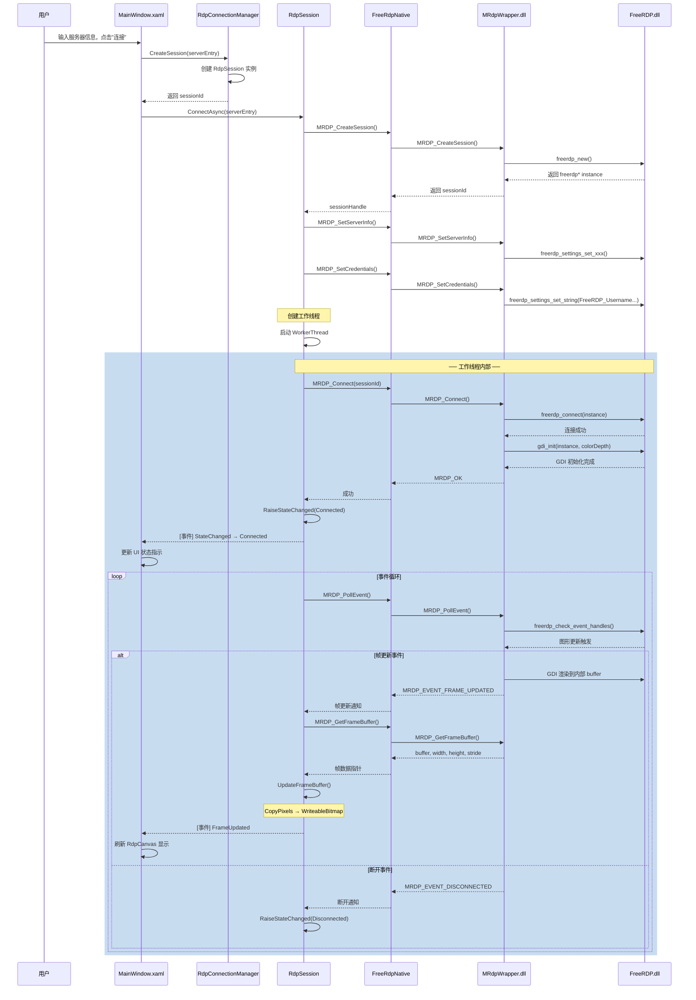
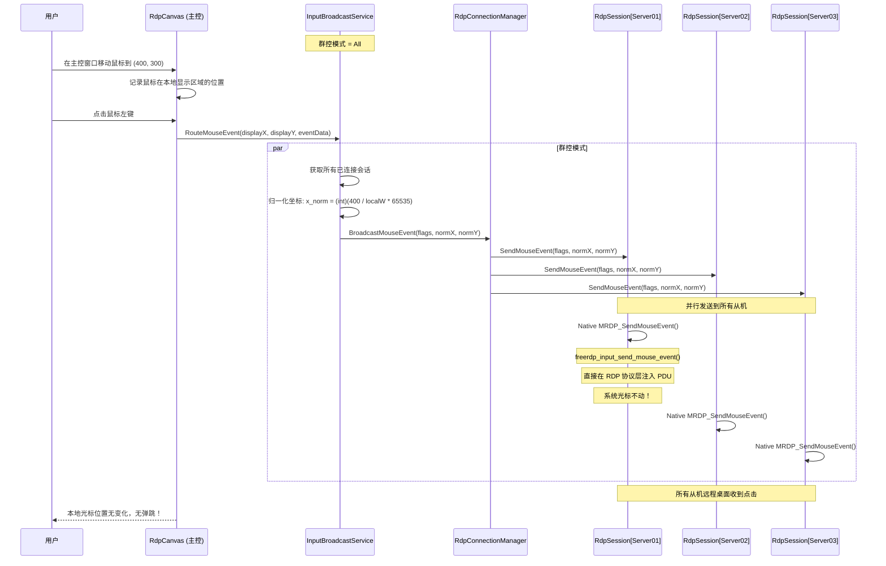
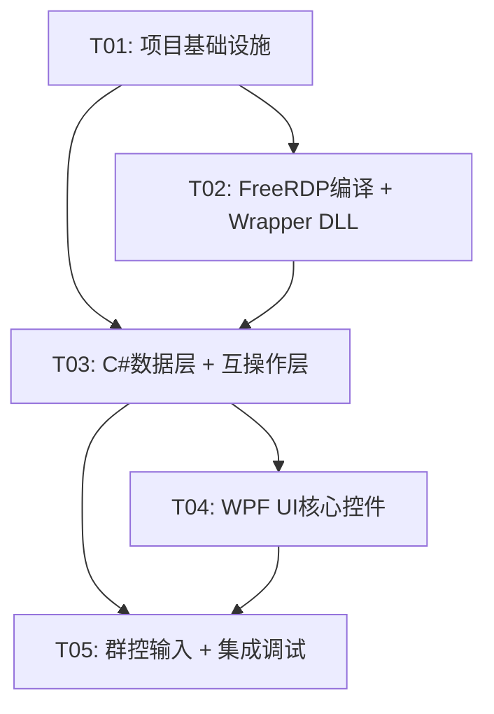

# MultiRDPManager 系统架构设计

> **架构师**: Bob  
> **版本**: v1.0  
> **日期**: 2026-06-17  

---

## Part A: 系统设计

---

### 1. 实现方案 + 框架选型

#### 1.1 核心挑战分析

| 挑战 | 说明 | 解决策略 |
|------|------|----------|
| FreeRDP Windows 编译 | FreeRDP 无官方预编译 Windows 二进制 | 使用 MSYS2 + MinGW-w64 编译原生 Windows DLL |
| C# 与 FreeRDP 互操作 | C 语言库无法被 C# 直接调用 | **C Wrapper DLL** 方案：构建薄封装层暴露 C 风格 API，C# 通过 P/Invoke 调用 |
| GDI 渲染到 WPF | FreeRDP 内部 GDI 渲染到内存 buffer | 注册 `UpdateCallback` → 读取 `gdi->primary->bitmap->data` → 复制到 `WriteableBitmap` |
| 输入注入 | 群控模式下不能移动系统光标 | 使用 `freerdp_input_send_mouse_event()` 在 RDP 协议层注入 PDU |
| 多实例共存 | 20-30 个 RDP 连接同时运行 | 每个连接独立 `freerdp*` + 独立线程 + 独立 `WriteableBitmap` |
| 图形性能 | 30 个窗口同时渲染 | 使用 `InteropBitmap` 零拷贝共享内存方案 |

#### 1.2 框架与库选型

| 组件 | 选型 | 理由 |
|------|------|------|
| RDP 引擎 | FreeRDP 3.27.0（源码编译） | 开源 RDP 实现，API 稳定，协议层输入注入 |
| C# RDP 互操作 | **C Wrapper DLL** + P/Invoke | 避免 C++/CLI 的版本依赖问题，纯 C 接口稳定 |
| 图形显示 | WPF `WriteableBitmap` / `InteropBitmap` | 高效内存共享，避免 GDI+ 转换开销 |
| 窗口布局 | WPF 自定义布局面板 | 支持 Grid / Tile / Cascade 多种布局 |
| 构建系统 | CMake（FreeRDP 编译）+ MSBuild（C# 编译） | 标准工具链 |
| NuGet 包管理 | .NET SDK | 管理 C# 依赖 |
| 日志 | Serilog | 结构化日志，支持文件和控制台 |

#### 1.3 架构模式

```
┌─────────────────────────────────────────────────────────────────┐
│                     WPF UI Layer (C#)                           │
│  ┌──────────┐ ┌──────────┐ ┌──────────┐ ┌──────────────────┐  │
│  │MainWindow│ │RdpCanvas │ │InputMgr  │ │ConnectionPanel   │  │
│  └────┬─────┘ └────┬─────┘ └────┬─────┘ └────────┬─────────┘  │
│       │            │            │                 │            │
├───────┴────────────┴────────────┴─────────────────┴────────────┤
│                   C# Service Layer                              │
│  ┌──────────────────────────────────────────────────────────┐  │
│  │  RdpConnectionManager (singleton)                        │  │
│  │  - Dictionary<string, RdpSession>                        │  │
│  │  - Connect / Disconnect / BroadcastInput                 │  │
│  └──────────────────────────────────────────────────────────┘  │
├─────────────────────────────────────────────────────────────────┤
│                  P/Invoke Interop Layer (C#)                    │
│  ┌──────────────────────────────────────────────────────────┐  │
│  │  NativeMethods (DllImport declarations)                  │  │
│  │  + FreeRdpNative (managed wrapper class)                 │  │
│  └──────────────────────────────────────────────────────────┘  │
├─────────────────────────────────────────────────────────────────┤
│            C Wrapper DLL (Native C - mrdp_wrapper.dll)         │
│  ┌──────────────────────────────────────────────────────────┐  │
│  │  MRDP_Connect / MRDP_Disconnect / MRDP_SendMouseEvent    │  │
│  │  MRDP_SendKeyboardEvent / MRDP_GetFrameBuffer            │  │
│  └──────────────────────────────────────────────────────────┘  │
├─────────────────────────────────────────────────────────────────┤
│                    FreeRDP Core Libraries (DLLs)                │
│  ┌──────────┐ ┌──────────────┐ ┌──────────┐ ┌──────────┐     │
│  │freerdp   │ │freerdp-client│ │freerdp-  │ │winpr     │     │
│  │.dll      │ │.dll          │ │gdi.dll   │ │.dll      │     │
│  └──────────┘ └──────────────┘ └──────────┘ └──────────┘     │
└─────────────────────────────────────────────────────────────────┘
```

#### 1.4 获取/编译 FreeRDP Windows DLL

**推荐方案：MSYS2 + MinGW-w64 编译**

```bash
# 1. 安装 MSYS2 (https://www.msys2.org/)
# 2. 打开 MSYS2 MINGW64 终端

# 3. 安装编译工具链和依赖
pacman -S mingw-w64-x86_64-toolchain mingw-w64-x86_64-cmake \
          mingw-w64-x86_64-openssl mingw-w64-x86_64-zlib \
          mingw-w64-x86_64-libwinpthread-git make

# 4. 进入 FreeRDP 源码目录（MSYS2 路径）
cd /c/Users/User/WorkBuddy/2026-06-13-23-02-00/MultiRDPManager-FreeRDP/freerdp-3.27.0/freerdp-3.27.0
mkdir build && cd build

# 5. 配置 CMake（最小化编译，仅编译需要的库）
cmake .. -G "MSYS Makefiles" \
  -DCMAKE_BUILD_TYPE=Release \
  -DWITH_CLIENT_WINDOWS=OFF \
  -DWITH_CLIENT_SDL=OFF \
  -DWITH_CLIENT_X11=OFF \
  -DWITH_SERVER=OFF \
  -DWITH_CHANNELS=OFF \
  -DWITH_CUPS=OFF \
  -DWITH_PCSC=OFF \
  -DWITH_FFMPEG=OFF \
  -DWITH_SOXR=OFF \
  -DWITH_ALSA=OFF \
  -DWITH_PULSEAUDIO=OFF \
  -DWITH_GSTREAMER=OFF \
  -DWITH_FAAC=OFF \
  -DWITH_FAAD2=OFF \
  -DWITH_WEBVIEW=OFF \
  -DWITH_WAYLAND=OFF \
  -DWITH_JPEG=OFF

# 6. 编译（使用 make -j$(nproc)）
make -j$(nproc)

# 7. 输出 DLL 位于 build/libfreerdp/ 和 build/winpr/ 下
#    需要的 DLL: libfreerdp.dll, libfreerdp-client.dll, 
#                libfreerdp-gdi.dll, libwinpr.dll
```

**编译成功后，将 DLL 复制到 C# 项目的输出目录**（如 `bin/Debug/net8.0/` 或 `bin/Release/net8.0/`）。

> **备选方案**：使用 vcpkg（`vcpkg install freerdp`），但 vcpkg 的 FreeRDP port 可能不是最新版本 3.27.0。

#### 1.5 C Wrapper DLL 设计

C Wrapper DLL（`mrdp_wrapper.dll`）是 C# 和 FreeRDP 之间的桥梁，职责包括：

1. **封装 FreeRDP 实例生命周期**：创建、连接、断连、销毁
2. **提供简化的 C 接口**：使用 C# 友好的类型（`int`, `void*`, `char*`）
3. **管理回调转发**：将 FreeRDP 的 C 回调转换为 C# 可轮询的状态/事件
4. **线程安全**：每个实例的操作通过 session ID 隔离

> 注意：C Wrapper DLL 需要 **单独编译**（MinGW 或 MSVC），与 FreeRDP 编译同步进行。

#### 1.6 图形渲染方案（FreeRDP GDI → WPF）

```
FreeRDP GDI Buffer (in memory)
        │
        ▼
  gdi->primary->bitmap->data  (BGRA 32bpp byte array)
        │
        ▼
  C Wrapper: MRDP_GetFrameBuffer(sessionId, &data, &width, &height, &stride)
        │
        ▼
  C#: WriteableBitmap.WritePixels()  /  InteropBitmap.Invalidate()
        │
        ▼
  WPF Image.Source = WriteableBitmap (绑定到 RdpCanvas)
```

**性能优化**：
- 使用 `InteropBitmap` + `VirtualMemoryPtr` 实现零拷贝渲染
- 仅在 FreeRDP `GDI_UPDATE_DIRTY_REGIONS` 回调触发时更新
- 使用 `DispatcherPriority.Render` 在 UI 线程批量更新
- 支持帧率限制（默认 30fps）

#### 1.7 输入注入方案

```c
// FreeRDP 核心 API - 直接在 RDP 协议层注入输入 PDU
// 不经过 Windows 本地输入系统，不移动系统光标

// 鼠标移动（绝对坐标，0-65535 范围，对应远程桌面分辨率）
freerdp_input_send_mouse_event(input, PTR_FLAGS_MOVE, x, y);

// 鼠标左键按下
freerdp_input_send_mouse_event(input, PTR_FLAGS_DOWN | PTR_FLAGS_BUTTON1, x, y);

// 鼠标左键释放
freerdp_input_send_mouse_event(input, PTR_FLAGS_BUTTON1, x, y);

// 键盘按键按下（使用 RDP 扫描码）
freerdp_input_send_keyboard_event(input, 0, RDP_SCANCODE_A);

// 键盘按键释放
freerdp_input_send_keyboard_event(input, KBD_FLAGS_RELEASE, RDP_SCANCODE_A);
```

**坐标空间说明**：
- `freerdp_input_send_mouse_event()` 的 x/y 是 **绝对坐标**
- 范围 0-65535，对应远程桌面的完整分辨率
- C# 侧计算：`x_local = (int)(mouseX / (double)localWidth * 65535)`
- 选择哪个从机：根据当前群控模式（全部/选中Tab）

#### 1.8 连接管理与多实例隔离

```
┌───────────────────────────────────────────────────────────┐
│                 RdpConnectionManager                      │
│                                                           │
│  sessions: Dictionary<string, RdpSession>                 │
│  ┌────────────┐ ┌────────────┐ ┌────────────┐           │
│  │ "Server01" │ │ "Server02" │ │ "Server03" │ ...        │
│  │ freerdp*   │ │ freerdp*   │ │ freerdp*   │           │
│  │ Thread     │ │ Thread     │ │ Thread     │           │
│  │ WritableBM │ │ WritableBM │ │ WritableBM │           │
│  └────────────┘ └────────────┘ └────────────┘           │
│                                                           │
│  群控输入 BroadcastInput() → 遍历 sessions 发送输入       │
└───────────────────────────────────────────────────────────┘
```

**凭据传递**：
- 用户名/密码/域名通过 `MRDP_SetCredentials(sessionId, user, pass, domain)` 设置
- 敏感信息使用 `SecureString` 在 C# 侧存储，P/Invoke 调用前 Marshal 到 IntPtr
- Wrapper DLL 内部调用 `freerdp_settings_set_string(settings, FreeRDP_Username, ...)`

**事件回调**：
- 连接状态变化：`OnConnecting` → `OnConnected` → `OnDisconnected` → `OnError`
- 通过 C# 轮询 `MRDP_GetStatus(sessionId)` 获取状态
- 或使用 Wrapper DLL 的窗口消息回调机制（`PostMessage` 到 WPF 窗口句柄）

---

### 2. 文件列表

```
MultiRDPManager-FreeRDP/
│
├── MultiRDPManager.sln                          # 解决方案文件
├── README.md                                    # 项目说明
│
├── docs/
│   ├── system_design.md                         # 本架构设计文档
│   ├── sequence-diagram.mermaid                 # 时序图
│   └── class-diagram.mermaid                    # 类图
│
├── src/
│   ├── MultiRDPManager/                         # WPF 主项目
│   │   ├── MultiRDPManager.csproj               # 项目文件
│   │   ├── App.xaml / App.xaml.cs               # 应用入口
│   │   ├── Program.cs                           # Main 函数
│   │   │
│   │   ├── Models/
│   │   │   ├── RdpServerEntry.cs                # 服务器条目模型
│   │   │   ├── ConnectionState.cs               # 连接状态枚举
│   │   │   └── BroadcastMode.cs                 # 群控模式枚举
│   │   │
│   │   ├── Services/
│   │   │   ├── IRdpSession.cs                   # RDP 会话接口
│   │   │   ├── RdpSession.cs                    # RDP 会话实现（单个连接）
│   │   │   ├── IRdpConnectionManager.cs         # 连接管理器接口
│   │   │   ├── RdpConnectionManager.cs          # 连接管理器实现（单例）
│   │   │   ├── IInputBroadcastService.cs        # 群控输入服务接口
│   │   │   └── InputBroadcastService.cs         # 群控输入服务实现
│   │   │
│   │   ├── Interop/
│   │   │   ├── NativeMethods.cs                 # P/Invoke DllImport 声明
│   │   │   ├── FreeRdpNative.cs                 # 托管包装类
│   │   │   ├── SafeSessionHandle.cs             # SafeHandle 封装
│   │   │   └── FreeRdpStatus.cs                 # 状态枚举和结构体
│   │   │
│   │   ├── Controls/
│   │   │   ├── RdpCanvas.xaml / .cs             # RDP 显示控件（核心）
│   │   │   ├── ServerListView.xaml / .cs        # 服务器列表控件
│   │   │   └── ConnectionToolbar.xaml / .cs     # 连接工具栏控件
│   │   │
│   │   ├── Windows/
│   │   │   ├── MainWindow.xaml / .cs            # 主窗口
│   │   │   └── ConnectionDialog.xaml / .cs      # 连接设置对话框
│   │   │
│   │   ├── Converters/
│   │   │   ├── ConnectionStateToColorConverter.cs
│   │   │   └── BoolToVisibilityConverter.cs
│   │   │
│   │   ├── Helpers/
│   │   │   ├── DispatcherHelper.cs              # UI 线程调度辅助
│   │   │   └── SecureStringHelper.cs            # 安全字符串辅助
│   │   │
│   │   └── Resources/
│   │       ├── Styles/
│   │       │   └── AppStyles.xaml               # 全局样式
│   │       └── Icons/                           # 图标资源
│   │
│   ├── MRdpWrapper/                             # C Wrapper DLL (C项目)
│   │   ├── CMakeLists.txt                       # CMake 构建文件
│   │   ├── mrdp_wrapper.h                       # 公共头文件（API 定义）
│   │   ├── mrdp_wrapper.c                       # 封装实现
│   │   ├── mrdp_session.h                       # 会话内部结构
│   │   ├── mrdp_session.c                       # 会话管理实现
│   │   ├── mrdp_graphics.c                      # 图形渲染对接
│   │   └── mrdp_input.c                         # 输入注入对接
│   │
│   └── freerdp-3.27.0/                          # FreeRDP 源码（已下载）
│       └── freerdp-3.27.0/
│           ├── CMakeLists.txt
│           ├── include/
│           ├── libfreerdp/
│           ├── winpr/
│           └── ...
│
├── build/
│   ├── freerdp/                                 # FreeRDP 编译输出目录
│   └── wrapper/                                 # Wrapper DLL 编译输出目录
│
├── lib/                                         # 第三方二进制依赖
│   ├── freerdp.dll
│   ├── freerdp-client.dll
│   ├── freerdp-gdi.dll
│   └── winpr.dll
│
└── scripts/
    ├── build-freerdp.sh                         # FreeRDP 编译脚本
    └── build-wrapper.sh                         # Wrapper DLL 编译脚本
```

---

### 3. 数据结构和接口（类图）

```mermaid
classDiagram
    %% ── 枚举 ──
    class ConnectionState {
        <<enumeration>>
        Disconnected
        Connecting
        Connected
        Disconnecting
        Error
    }

    class BroadcastMode {
        <<enumeration>>
        Disabled
        All
        SelectedTab
    }

    class FreeRdpStatus {
        <<enumeration>>
        OK = 0
        ErrorGeneral = -1
        ErrorConnect = -2
        ErrorDisconnect = -3
        ErrorTLSCert = -4
        ErrorAuth = -5
        ErrorTimeout = -6
    }

    %% ── 模型 ──
    class RdpServerEntry {
        +string Id
        +string Name
        +string Host
        +int Port
        +string Username
        +SecureString Password
        +string Domain
        +int DesktopWidth
        +int DesktopHeight
        +ConnectionState State
        +string GetDisplayName()
    }

    %% ── 接口 ──
    class IRdpSession {
        <<interface>>
        +string Id
        +string ServerName
        +ConnectionState State
        +WriteableBitmap FrameBuffer
        +event EventHandler~RdpSessionEventArgs~ StateChanged
        +event EventHandler~RdpSessionEventArgs~ FrameUpdated
        +Task ConnectAsync(RdpServerEntry server)
        +Task DisconnectAsync()
        +void SendMouseEvent(MouseEventFlags flags, int x, int y)
        +void SendKeyboardEvent(KeyboardEventFlags flags, byte scanCode)
        +void SendSynchronizeEvent()
    }

    class IRdpConnectionManager {
        <<interface>>
        +IReadOnlyDictionary~string, IRdpSession~ Sessions
        +BroadcastMode CurrentBroadcastMode
        +IRdpSession CreateSession(RdpServerEntry server)
        +bool RemoveSession(string sessionId)
        +Task ConnectSessionAsync(string sessionId)
        +Task DisconnectSessionAsync(string sessionId)
        +Task DisconnectAllAsync()
        +void BroadcastMouseEvent(MouseEventFlags flags, int x, int y)
        +void BroadcastKeyboardEvent(KeyboardEventFlags flags, byte scanCode)
        +event EventHandler~RdpSessionEventArgs~ SessionCreated
        +event EventHandler~RdpSessionEventArgs~ SessionRemoved
    }

    class IInputBroadcastService {
        <<interface>>
        +BroadcastMode Mode
        +HashSet~string~ TargetSessionIds
        +void RouteMouseEvent(int displayX, int displayY, MouseEventData data)
        +void RouteKeyboardEvent(KeyboardEventData data)
        +void RouteScrollEvent(ScrollEventData data)
    }

    %% ── 实现类 ──
    class RdpSession {
        -string _sessionId
        -IntPtr _nativeHandle
        -Thread _workerThread
        -WriteableBitmap _frameBuffer
        -bool _isRunning
        -int _width
        -int _height
        -int _stride
        -byte[] _dirtyBuffer
        +string Id
        +string ServerName
        +ConnectionState State
        +WriteableBitmap FrameBuffer
        +event EventHandler~RdpSessionEventArgs~ StateChanged
        +event EventHandler~RdpSessionEventArgs~ FrameUpdated
        +Task ConnectAsync(RdpServerEntry server)
        +Task DisconnectAsync()
        +void SendMouseEvent(MouseEventFlags flags, int x, int y)
        +void SendKeyboardEvent(KeyboardEventFlags flags, byte scanCode)
        +void SendSynchronizeEvent()
        -void WorkerThreadLoop()
        -void ProcessNativeCallbacks()
        -void UpdateFrameBuffer()
        -void RaiseStateChanged(ConnectionState newState)
        -void RaiseFrameUpdated()
    }

    class RdpConnectionManager {
        -Dictionary~string, RdpSession~ _sessions
        -BroadcastMode _broadcastMode
        -InputBroadcastService _inputService
        -object _lockObj
        +IReadOnlyDictionary~string, IRdpSession~ Sessions
        +BroadcastMode CurrentBroadcastMode
        +IRdpSession CreateSession(RdpServerEntry server)
        +bool RemoveSession(string sessionId)
        +Task ConnectSessionAsync(string sessionId)
        +Task DisconnectSessionAsync(string sessionId)
        +Task DisconnectAllAsync()
        +void BroadcastMouseEvent(MouseEventFlags flags, int x, int y)
        +void BroadcastKeyboardEvent(KeyboardEventFlags flags, byte scanCode)
        +event EventHandler~RdpSessionEventArgs~ SessionCreated
        +event EventHandler~RdpSessionEventArgs~ SessionRemoved
    }

    class InputBroadcastService {
        -RdpConnectionManager _manager
        -Dictionary~string, NormalizedRect~ _clientRects
        +BroadcastMode Mode
        +HashSet~string~ TargetSessionIds
        +void RouteMouseEvent(int displayX, int displayY, MouseEventData data)
        +void RouteKeyboardEvent(KeyboardEventData data)
        +void RouteScrollEvent(ScrollEventData data)
        -int NormalizeCoordinate(int coord, int localSize, int remoteSize)
    }

    %% ── 事件参数 ──
    class RdpSessionEventArgs {
        +string SessionId
        +string ServerName
        +ConnectionState State
        +string ErrorMessage
    }

    class MouseEventData {
        +MouseEventFlags Flags
        +int X
        +int Y
    }

    class KeyboardEventData {
        +KeyboardEventFlags Flags
        +byte ScanCode
    }

    class ScrollEventData {
        +int Delta
        +bool IsHorizontal
    }

    class MouseEventFlags {
        <<enumeration>>
        Move = 0x0800
        Down = 0x8000
        Button1 = 0x1000
        Button2 = 0x2000
        Button3 = 0x4000
        Wheel = 0x0200
        HWheel = 0x0400
    }

    class KeyboardEventFlags {
        <<enumeration>>
        Extended = 0x0100
        Extended1 = 0x0200
        Down = 0x4000
        Release = 0x8000
    }

    %% ── 关系 ──
    RdpSession ..|> IRdpSession
    RdpConnectionManager ..|> IRdpConnectionManager
    InputBroadcastService ..|> IInputBroadcastService
    RdpConnectionManager o-- "many" RdpSession : manages >
    RdpConnectionManager o-- InputBroadcastService : uses >
    InputBroadcastService --> RdpConnectionManager : references >
    InputBroadcastService --> MouseEventData
    InputBroadcastService --> KeyboardEventData
    InputBroadcastService --> ScrollEventData
    RdpSession --> ConnectionState
    RdpSession --> RdpServerEntry
    RdpSession ..> MouseEventFlags
    RdpSession ..> KeyboardEventFlags
    RdpConnectionManager ..> BroadcastMode
    RdpConnectionManager ..> RdpSessionEventArgs : raises >
```



#### 关键 P/Invoke 声明（NativeMethods.cs）

```csharp
// 对应 C Wrapper DLL (mrdp_wrapper.dll) 的 API

[DllImport("mrdp_wrapper.dll", CallingConvention = CallingConvention.Cdecl)]
internal static extern int MRDP_Initialize();

[DllImport("mrdp_wrapper.dll", CallingConvention = CallingConvention.Cdecl)]
internal static extern void MRDP_Uninitialize();

[DllImport("mrdp_wrapper.dll", CallingConvention = CallingConvention.Cdecl)]
internal static extern IntPtr MRDP_CreateSession(out int sessionId);

[DllImport("mrdp_wrapper.dll", CallingConvention = CallingConvention.Cdecl)]
internal static extern int MRDP_SetCredentials(int sessionId,
    [MarshalAs(UnmanagedType.LPUTF8Str)] string username,
    [MarshalAs(UnmanagedType.LPUTF8Str)] string password,
    [MarshalAs(UnmanagedType.LPUTF8Str)] string domain);

[DllImport("mrdp_wrapper.dll", CallingConvention = CallingConvention.Cdecl)]
internal static extern int MRDP_SetServerInfo(int sessionId,
    [MarshalAs(UnmanagedType.LPUTF8Str)] string hostname,
    int port, int width, int height);

[DllImport("mrdp_wrapper.dll", CallingConvention = CallingConvention.Cdecl)]
internal static extern int MRDP_Connect(int sessionId);

[DllImport("mrdp_wrapper.dll", CallingConvention = CallingConvention.Cdecl)]
internal static extern int MRDP_Disconnect(int sessionId);

[DllImport("mrdp_wrapper.dll", CallingConvention = CallingConvention.Cdecl)]
internal static extern void MRDP_DestroySession(int sessionId);

[DllImport("mrdp_wrapper.dll", CallingConvention = CallingConvention.Cdecl)]
internal static extern int MRDP_GetConnectionState(int sessionId);

[DllImport("mrdp_wrapper.dll", CallingConvention = CallingConvention.Cdecl)]
internal static extern int MRDP_PollEvent(int sessionId, out int eventType,
    out IntPtr eventData, out int dataSize);

[DllImport("mrdp_wrapper.dll", CallingConvention = CallingConvention.Cdecl)]
internal static extern int MRDP_GetFrameBuffer(int sessionId,
    out IntPtr buffer, out int width, out int height, out int stride,
    out int pixelFormat);

[DllImport("mrdp_wrapper.dll", CallingConvention = CallingConvention.Cdecl)]
internal static extern int MRDP_SendMouseEvent(int sessionId,
    ushort flags, ushort x, ushort y);

[DllImport("mrdp_wrapper.dll", CallingConvention = CallingConvention.Cdecl)]
internal static extern int MRDP_SendKeyboardEvent(int sessionId,
    ushort flags, byte code);

[DllImport("mrdp_wrapper.dll", CallingConvention = CallingConvention.Cdecl)]
internal static extern int MRDP_SendSynchronizeEvent(int sessionId,
    uint flags);
```

#### C Wrapper DLL 核心 API（mrdp_wrapper.h）

```c
#ifndef MRDP_WRAPPER_H
#define MRDP_WRAPPER_H

#ifdef __cplusplus
extern "C" {
#endif

/* 错误码 */
#define MRDP_OK              0
#define MRDP_ERR_GENERAL    -1
#define MRDP_ERR_CONNECT    -2
#define MRDP_ERR_DISCONNECT -3
#define MRDP_ERR_INVALID    -4

/* 连接状态 */
#define MRDP_STATE_DISCONNECTED  0
#define MRDP_STATE_CONNECTING    1
#define MRDP_STATE_CONNECTED     2
#define MRDP_STATE_DISCONNECTING 3
#define MRDP_STATE_ERROR         4

/* 事件类型 */
#define MRDP_EVENT_NONE          0
#define MRDP_EVENT_CONNECTED     1
#define MRDP_EVENT_DISCONNECTED  2
#define MRDP_EVENT_FRAME_UPDATED 3
#define MRDP_EVENT_ERROR         4
#define MRDP_EVENT_CLIPBOARD     5

/* ─── 生命周期 ─── */
int MRDP_Initialize(void);
void MRDP_Uninitialize(void);

/* ─── 会话管理 ─── */
int  MRDP_CreateSession(int* outSessionId);
int  MRDP_SetCredentials(int sessionId, const char* username,
                         const char* password, const char* domain);
int  MRDP_SetServerInfo(int sessionId, const char* hostname,
                        int port, int width, int height);
int  MRDP_Connect(int sessionId);
int  MRDP_Disconnect(int sessionId);
void MRDP_DestroySession(int sessionId);

/* ─── 状态查询 ─── */
int MRDP_GetConnectionState(int sessionId);
int MRDP_PollEvent(int sessionId, int* outEventType,
                   void** outEventData, int* outDataSize);

/* ─── 帧缓冲 ─── */
int MRDP_GetFrameBuffer(int sessionId, void** outBuffer,
                        int* outWidth, int* outHeight,
                        int* outStride, int* outPixelFormat);

/* ─── 输入注入 ─── */
int MRDP_SendMouseEvent(int sessionId, unsigned short flags,
                        unsigned short x, unsigned short y);
int MRDP_SendKeyboardEvent(int sessionId, unsigned short flags,
                           unsigned char code);
int MRDP_SendSynchronizeEvent(int sessionId, unsigned int flags);

#ifdef __cplusplus
}
#endif

#endif /* MRDP_WRAPPER_H */
```

---

### 4. 程序调用流程（时序图）

#### 4.1 连接流程：用户点击连接 → 显示远程桌面



#### 4.2 群控输入注入流程



---

### 5. 待明确事项

| 序号 | 待明确事项 | 影响 | 建议 |
|------|-----------|------|------|
| 1 | **FreeRDP 在 Windows 上的 SSL/TLS 支持** | 需要 OpenSSL 或 Schannel 后端，直接影响 NLA 认证是否可用 | 优先使用 MSYS2 的 mingw-w64-x86_64-openssl |
| 2 | **FreeRDP GDI 输出像素格式** | C# 侧需要匹配 pixel format 来正确显示 | 编译时设置 `-DFREERDP_PIXEL_FORMAT=BGRA32`，兼容 WPF |
| 3 | **Wrapper DLL 编译工具链** | MinGW 编译的 DLL 与 MSVC 编译的 C# 互操作的 ABI 兼容性 | 需要验证 `cdecl` 调用约定和结构体对齐 |
| 4 | **多线程帧缓冲访问竞态** | Worker 线程写 buffer 的同时 UI 线程读 buffer | 使用 double buffering 或 `Interlocked.Exchange` 交换指针 |
| 5 | **FreeRDP 3.27.0 对 Windows 7/10/11 的兼容性** | 某些 Windows API 可能在新版本中变更 | 建议在 Windows 10/11 上验证 |
| 6 | **网络超时和断线重连** | 管理 20-30 个连接时，网络波动需要优雅处理 | FreeRDP 内置 `AutoReconnect` 可启用 |
| 7 | **剪贴板重定向** | 多实例间剪贴板共享的需求 | FreeRDP 支持 cliprdr channel，但 PoC 阶段可暂不实现 |
| 8 | **音频重定向** | 远程桌面的声音输出 | FreeRDP 支持 rdpsnd channel，PoC 阶段暂不实现 |

---

## Part B: 任务分解

---

### 6. 所需依赖包

#### NuGet 包（C# 项目）

```
- Microsoft.Windows.SDK.Contracts  (Windows API 互操作)
- Serilog                          (结构化日志)
- Serilog.Sinks.File               (文件日志)
- Serilog.Sinks.Console            (控制台日志)
- System.Management                (系统信息，可选)
```

#### 系统依赖

```
- .NET 8.0 SDK 或更高版本
- Visual Studio 2022 (或 JetBrains Rider)
- MSYS2 + MinGW-w64 (用于编译 FreeRDP)
- CMake >= 3.13 (FreeRDP 编译)
- OpenSSL (FreeRDP 的 SSL/TLS 依赖，通过 MSYS2 安装)
```

---

### 7. 任务列表（按依赖顺序，最多5个）

| 任务ID | 名称 | 主要源文件 | 依赖 | 优先级 |
|--------|------|-----------|------|--------|
| T01 | **项目基础设施** | MultiRDPManager.sln, MultiRDPManager.csproj, Program.cs, App.xaml, App.xaml.cs, CMakeLists.txt, build-freerdp.sh, build-wrapper.sh | 无 | P0 |
| T02 | **FreeRDP 编译 + Wrapper DLL** | lib/*.dll, MRdpWrapper/CMakeLists.txt, mrdp_wrapper.h, mrdp_wrapper.c, mrdp_session.h, mrdp_session.c, mrdp_graphics.c, mrdp_input.c | T01 | P0 |
| T03 | **C# 数据层 + 互操作层** | NativeMethods.cs, FreeRdpNative.cs, SafeSessionHandle.cs, FreeRdpStatus.cs, Models/*.cs, Services/*.cs | T01, T02 | P0 |
| T04 | **WPF UI 核心控件** | MainWindow.xaml/.cs, RdpCanvas.xaml/.cs, ServerListView.xaml/.cs, ConnectionDialog.xaml/.cs, Converters/*.cs, Helpers/*.cs | T03 | P1 |
| T05 | **群控输入 + 集成调试** | InputBroadcastService.cs, ConnectionToolbar.xaml/.cs, 集成调试 | T03, T04 | P1 |

#### T01: 项目基础设施

- **源文件**:
  - `MultiRDPManager.sln` — 解决方案文件
  - `src/MultiRDPManager/MultiRDPManager.csproj` — 项目配置（TargetFramework=net8.0-windows, UseWPF=true）
  - `src/MultiRDPManager/App.xaml` + `App.xaml.cs` — 应用入口
  - `src/MultiRDPManager/Program.cs` — Main 函数
  - `src/MultiRDPManager/Resources/Styles/AppStyles.xaml` — 全局样式
  - `scripts/build-freerdp.sh` — FreeRDP 编译脚本
  - `scripts/build-wrapper.sh` — Wrapper DLL 编译脚本
  - `README.md` — 项目说明

- **内容**: 创建解决方案、项目文件、配置 NuGet 包、编写编译脚本、创建目录结构骨架

- **依赖**: 无

#### T02: FreeRDP 编译 + Wrapper DLL

- **源文件**:
  - `src/MRdpWrapper/CMakeLists.txt` — Wrapper DLL 的 CMake 构建
  - `src/MRdpWrapper/mrdp_wrapper.h` — 公共 API 头文件
  - `src/MRdpWrapper/mrdp_wrapper.c` — API 实现入口
  - `src/MRdpWrapper/mrdp_session.h` — 会话内部结构体定义
  - `src/MRdpWrapper/mrdp_session.c` — 会话生命周期管理
  - `src/MRdpWrapper/mrdp_graphics.c` — GDI 渲染回调注册和帧缓冲管理
  - `src/MRdpWrapper/mrdp_input.c` — 输入注入封装
  - `lib/freerdp.dll` (编译产物复制)
  - `lib/freerdp-client.dll` (编译产物复制)
  - `lib/freerdp-gdi.dll` (编译产物复制)
  - `lib/winpr.dll` (编译产物复制)
  - `lib/mrdp_wrapper.dll` (编译产物)

- **内容**:
  1. 在 MSYS2 MINGW64 环境中编译 FreeRDP 源码，得到 `libfreerdp.dll`, `libfreerdp-client.dll`, `libfreerdp-gdi.dll`, `libwinpr.dll`
  2. 编写 C Wrapper DLL，封装 FreeRDP 核心操作
  3. 编译 Wrapper DLL，与 FreeRDP DLL 一起输出到 `lib/` 目录

- **依赖**: T01

#### T03: C# 数据层 + 互操作层

- **源文件**:
  - `src/MultiRDPManager/Interop/NativeMethods.cs` — P/Invoke DllImport 声明
  - `src/MultiRDPManager/Interop/FreeRdpNative.cs` — 托管包装类
  - `src/MultiRDPManager/Interop/SafeSessionHandle.cs` — 安全句柄封装
  - `src/MultiRDPManager/Interop/FreeRdpStatus.cs` — 状态枚举和结构体
  - `src/MultiRDPManager/Models/RdpServerEntry.cs` — 服务器条目模型
  - `src/MultiRDPManager/Models/ConnectionState.cs` — 连接状态枚举
  - `src/MultiRDPManager/Models/BroadcastMode.cs` — 群控模式枚举
  - `src/MultiRDPManager/Services/IRdpSession.cs` — RDP 会话接口
  - `src/MultiRDPManager/Services/RdpSession.cs` — RDP 会话实现
  - `src/MultiRDPManager/Services/IRdpConnectionManager.cs` — 连接管理接口
  - `src/MultiRDPManager/Services/RdpConnectionManager.cs` — 连接管理实现
  - `src/MultiRDPManager/Services/IInputBroadcastService.cs` — 群控输入接口
  - `src/MultiRDPManager/Services/InputBroadcastService.cs` — 群控输入实现

- **内容**: 实现所有 P/Invoke 声明、托管包装类、数据模型、服务层接口和实现。包含线程安全的会话管理、帧缓冲更新逻辑、输入坐标归一化。

- **依赖**: T01, T02

#### T04: WPF UI 核心控件

- **源文件**:
  - `src/MultiRDPManager/Windows/MainWindow.xaml` + `MainWindow.xaml.cs` — 主窗口
  - `src/MultiRDPManager/Windows/ConnectionDialog.xaml` + `ConnectionDialog.xaml.cs` — 连接设置对话框
  - `src/MultiRDPManager/Controls/RdpCanvas.xaml` + `RdpCanvas.xaml.cs` — RDP 显示控件
  - `src/MultiRDPManager/Controls/ServerListView.xaml` + `ServerListView.xaml.cs` — 服务器列表
  - `src/MultiRDPManager/Converters/ConnectionStateToColorConverter.cs` — 状态颜色转换
  - `src/MultiRDPManager/Converters/BoolToVisibilityConverter.cs` — 可见性转换
  - `src/MultiRDPManager/Helpers/DispatcherHelper.cs` — UI 线程调度
  - `src/MultiRDPManager/Helpers/SecureStringHelper.cs` — 安全字符串处理

- **内容**: 实现所有 WPF 界面控件。RdpCanvas 是核心控件，负责将 WriteableBitmap 渲染到 WPF Image 控件，处理鼠标/键盘事件捕获并转发到输入服务。

- **依赖**: T03

#### T05: 群控输入 + 集成调试

- **源文件**:
  - `src/MultiRDPManager/Controls/ConnectionToolbar.xaml` + `ConnectionToolbar.xaml.cs` — 连接工具栏
  - 修改 `MainWindow.xaml` / `MainWindow.xaml.cs` — 集成所有控件
  - 修改 `RdpCanvas.xaml.cs` — 完善群控模式的输入事件处理
  - 最终集成调试

- **内容**:
  1. 实现群控模式切换 UI（单控/群控全部/群控选中Tab）
  2. 集成所有组件：主窗口布局、服务器列表、RDP 显示区域、连接工具栏
  3. 调试：用 2-3 台 Windows 远程桌面验证：
     - 单个连接/断连
     - 群控模式输入注入（验证光标不弹跳）
     - 多实例独立运行
  4. 编写 `README.md` 使用说明

- **依赖**: T03, T04

---

### 8. 共享知识

| 约定项 | 规范 |
|--------|------|
| **P/Invoke 调用约定** | 所有 `mrdp_wrapper.dll` 导出函数使用 `Cdecl` |
| **字符串编组** | C# → C 使用 `[MarshalAs(UnmanagedType.LPUTF8Str)]`；C → C# 使用 `IntPtr` + `Marshal.PtrToStringUTF8()` |
| **线程模型** | FreeRDP 工作线程（每个会话独立） + WPF UI 线程。所有 UI 更新必须通过 `Dispatcher.InvokeAsync` |
| **帧缓冲更新** | 工作线程写 `IntPtr` 指向的 buffer，UI 线程通过 `WriteableBitmap.Lock()` / `AddDirtyRect()` / `Unlock()` 渲染。使用 double-buffering 避免竞态 |
| **错误处理** | 所有 `MRDP_*` API 返回 `int`：`>= 0` 表示成功，`< 0` 表示错误码。C# 侧统一包装为 `FreeRdpException` |
| **日志** | 使用 Serilog，输出到 `logs/mrdp-{Date}.log`，格式 `{Timestamp} [{Level}] {SessionId}: {Message}` |
| **敏感信息** | 密码在 C# 侧使用 `SecureString`，仅在 P/Invoke 调用前 Marshal 到非托管内存，调用后立即 `ZeroFreeGlobalAllocUnicode` |
| **命名规范** | C#: PascalCase 类名/方法名，_camelCase 私有字段；C: MRDP_PascalCase 导出函数，mrdp_snake_case 内部函数 |
| **FreeRDP 坐标** | 鼠标绝对坐标范围 0-65535，与本地显示分辨率无关。归一化公式：`x_rdp = (int)(localX / (double)localWidth * 65535)` |
| **RDP 扫描码** | 键盘使用 RDP 扫描码（非 Windows 虚拟键码），参考 `freerdp/scancode.h` |
| **群控隔离** | 群控输入广播时跳过发送方自身（防止回声），通过 `RdpSession.IsMaster` 和 `InputBroadcastService.SourceSessionId` 控制 |

---

### 9. 任务依赖图



| 阶段 | 可并行工作 |
|------|-----------|
| **Phase 1** (P0) | T01 (必须首先完成) |
| **Phase 2** (P0) | T02 (编译 FreeRDP/Wrapper) 和 T03 (数据层/互操作层) — T02 是 T03 的前置 |
| **Phase 3** (P1) | T04 (UI 控件) 和 T05 (群控) — T03 完成即可并行 |
